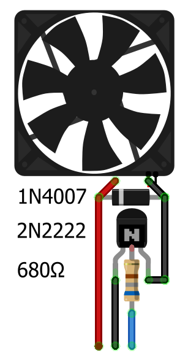
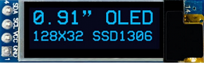

# server


## Clone repository
```
cd
git clone https://github.com/maltsevvv/server.git
cd server
```

## Connection FAN



  * +5V
  * GND
  * GPIO 23
  
### Hardware components
  * Raspberry Pi
  * Fan 5VDC 0.2A
  * Transistor NPN 2N2222
  * Diode 1N4007 (1A 1000V)


### To read tempreture of raspberry pi CPU
```
cat /sys/class/thermal/thermal_zone0/temp
```

### To test and choose suitable fan speed
```
python fan_calib.py
```

`Fan Speed: 0`

`Fan Speed: 100`

`Fan Speed: 40`


### To run main program
```
python fan_ctrl.py
```

### Configure to auto-run fan after reboot
```
sudo cp fan_ctrl.py /usr/local/bin/
```

### Copy fan_control.service
```
sudo cp fan_control.service /etc/systemd/system/
```

### Start fan_control.service
```
sudo systemctl enable fan_control.service
sudo systemctl start fan_control.service
```


## Button reboot
```
python button_reboot.py
```

### Configure to auto-run button_reboot after reboot
```
sudo cp button_reboot.py /usr/local/bin/
```

### Copy button_reboot.service
```
sudo cp button_reboot.service /etc/systemd/system/
```

### Start button_reboot.service
```
sudo systemctl enable button_reboot.service
sudo systemctl start button_reboot.service
```


## Raspberry Pi Status Monitor with SSD1306 128x32 OLED 



### status show
  * Time
  * CPU temp
  * HDD1 free *** % (/dev/sda1)
  * HDD2 free *** % (/dev/sdb1)

### Enable I2C Raspberry
```
sudo raspi-config
```

### Install packages
```
sudo apt-get install -y git python3-pip python3-pil i2c-tools
```

```
sudo pip3 install adafruit-circuitpython-ssd1306
```

### Check I2C 
```
sudo i2cdetect -y 1
```

### To run main program
```
python3 pistatus/pistatus.py
```

### Configure to auto-run pistatus after reboot
```
sudo cp -r pistatus.py /usr/local/bin/
```

### Copy fan_control.service
```
sudo cp pistatus/pistatus.service /etc/systemd/system/
```

### Start fan_control.service
```
sudo systemctl enable pistatus.service
sudo systemctl start pistatus.service
```

## Led status
```
sudo nano /boot/config.txt
```

`enable_uart=1`
